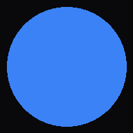

# DECODED — Dating Intelligence OS

> High-EQ behavioral psychology & texting subtext analyzer powered by Mark Manson's non-neediness framework and Groq Cloud ultra-fast inference.



---

## ⚡ Features

1. **Voice Calibration Engine (Anti-Impostor Voiceprint)**:
   - Constrains generated Safe and Bold response plays to mirror your natural casing, cadence, and deadpan humor.
2. **Contact Dossiers & Trajectory Tracking**:
   - Manages distinct contact profiles with historical progression tracking (📈 *Accelerating Interest*, ⚖️ *Stable / Plateau*, 📉 *Decelerating / Frame Loss*).
3. **The "Walk-Away" Dignity Diagnostic**:
   - Automatically detects low reciprocity or fading dynamics, providing clear non-reactive walk-away plays and re-engagement rules.
4. **Mark Manson Behavioral Engine**:
   - Grounded in radical honesty, outcome independence, and concise, anti-cringe human texting syntax (5–12 words, zero emojis).
5. **Standalone PWA & Apple-Tier Polish**:
   - Ready for iOS & Android standalone home-screen install with dark frosted-glass visuals and fluid spring physics.

---

## 🚀 Deploy to Vercel (1-Click Ready)

1. Push this repository to GitHub.
2. Import the project into **[Vercel](https://vercel.com)**.
3. Configure the following Environment Variables under **Project Settings > Environment Variables**:

| Variable | Recommended Value | Description |
| :--- | :--- | :--- |
| `LLM_API_KEY` | `gsk_...` | Your Groq Cloud API Key |
| `LLM_BASE_URL` | `https://api.groq.com/openai/v1` | Groq OpenAI-compatible API endpoint |
| `LLM_MODEL` | `openai/gpt-oss-120b` | High-capacity reasoning model |

*(Note: If no API key is provided, the app will seamlessly run on the built-in psychological heuristics fallback engine).*

---

## 💻 Local Development

```bash
# Install dependencies
npm install

# Run dev server
npm run dev

# Build production bundle
npm run build
```

---

## 🛡️ Tech Stack
- **Framework**: Next.js 14 (App Router, Edge Runtime API)
- **Styling**: Tailwind CSS + Frosted Glass Design System
- **Animation**: Framer Motion (Emil Kowalski spring physics)
- **Icons**: Lucide React
- **Typography**: Inter + Space Grotesk
